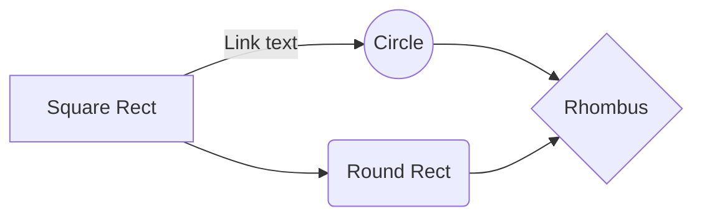

MiniWebProjectProject for testingHow to setup for run server

1.  go to root of directory foldersrun setup “bash   runSetup.sh/">](httprunSetup.sh/)”
3.  enjoy

How to setup for dev website

*require

-   nodejs
-   vue-cil

1.  go to root of directory folders and go to webtype “npm install” for download package
3.  type npm run dev for start dev server

<!--stackedit_data:
eyJoaXN0b3J5IjpbMzk5NDg3Njg5XX0=
-->